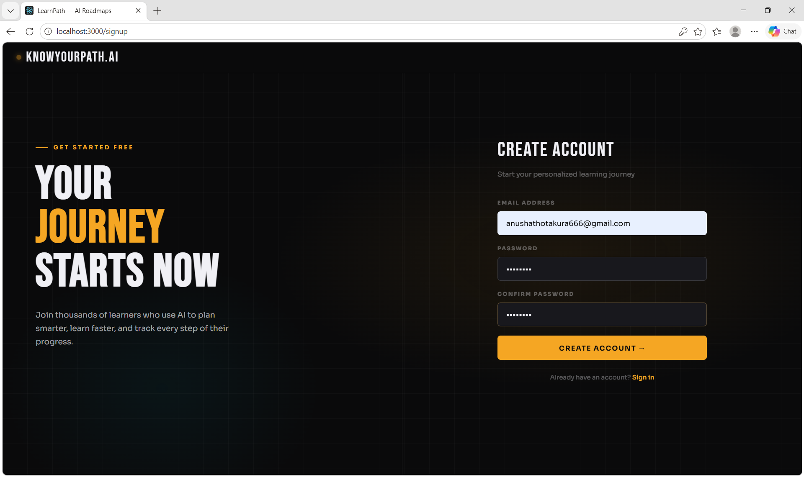
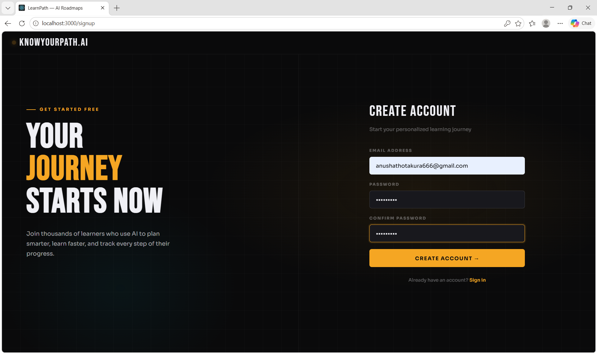
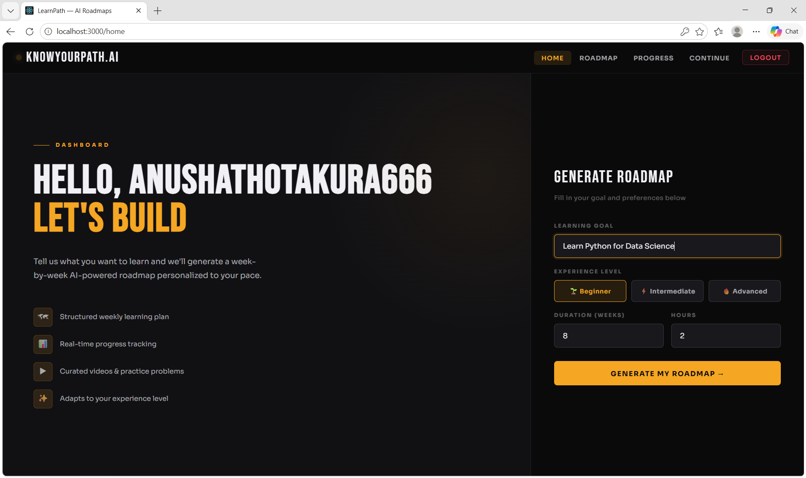
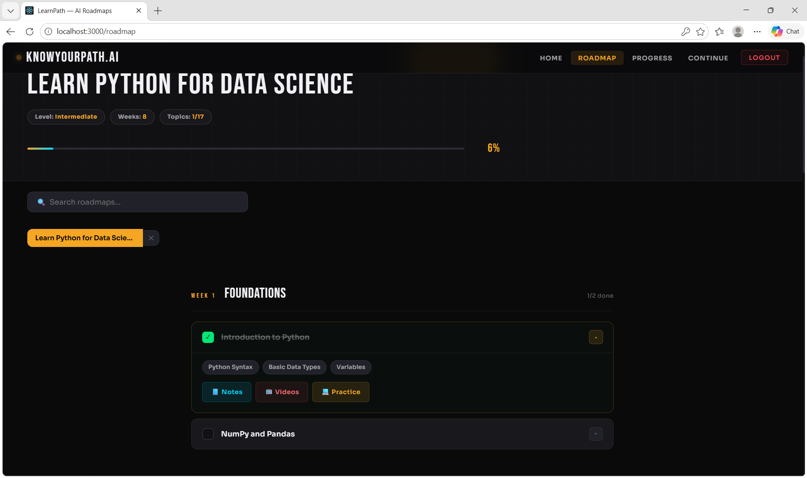
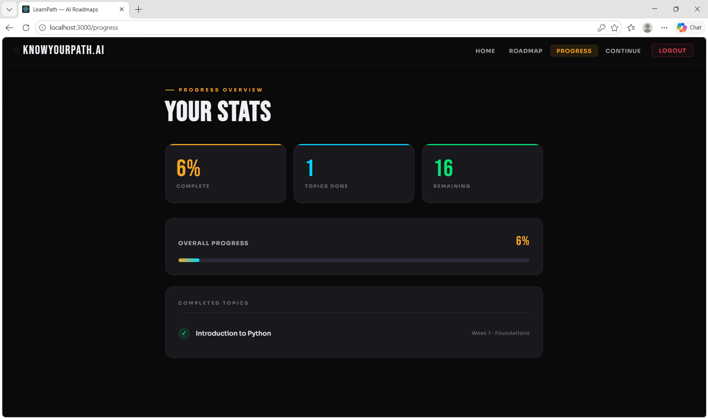
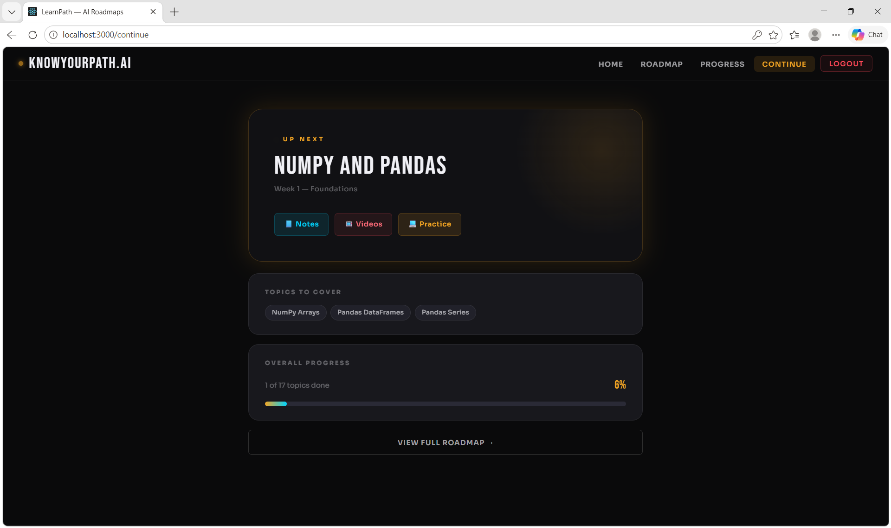

# KnowYourPath.ai 🗺️

> AI-powered personalized learning roadmap generator — built with React + Flask + Groq LLaMA 3.1

A full-stack web app where you enter a learning goal, your experience level,
and available hours — and get a structured week-by-week AI-powered study plan.

---

## 🎬 Demo

> Generate a roadmap in seconds 👇

## 📸 Screenshots

### 🔐 Login


### 📝 Signup


### 🏠 Dashboard — Generate Your Roadmap


### 🗺️ AI Generated Roadmap


### 📊 Progress Tracker


### ▶️ Continue Page


---

## ✨ Features

- 🤖 AI roadmap generation using Groq LLaMA 3.1
- 📊 Week-by-week structured learning plan
- ✅ Topic progress tracking (saved to database)
- 🗂️ Save and manage multiple roadmaps
- 📄 Export roadmap as PDF
- 🔐 User authentication (signup/login)

---

## 🛠️ Tech Stack

| Layer | Technology |
|---|---|
| Frontend | React 18, React Router v6, jsPDF |
| Backend | Python, Flask, Flask-CORS |
| AI | Groq API — LLaMA 3.1 8B Instant |
| Database | SQLite |

---

## 📁 Project Structure---

## 🚀 Getting Started

### 1. Clone the repo
```bash
git clone https://github.com/Anusha-Thotakura/KnowYourPath.ai.git
cd KnowYourPath.ai
```

### 2. Set up Backend
```bash
pip install flask flask-cors requests
```

Create a `.env` file:

GROQ_API_KEY=your_groq_api_key_here
SECRET_KEY=your_secret_key_here

Run the server:
```bash
python app.py
```

### 3. Set up Frontend
```bash
npm install
npm start
```

App runs at `http://localhost:3000` 🚀

---

## 🔌 API Endpoints

| Method | Endpoint | Description |
|---|---|---|
| POST | `/signup` | Register new user |
| POST | `/login` | Login user |
| GET | `/logout` | Clear session |
| POST | `/generate-roadmap` | Generate AI roadmap |
| POST | `/save-progress` | Save topic completion |
| GET | `/load-progress` | Load user progress |

---

## 🔑 Environment Variables

| Variable | Description |
|---|---|
| `GROQ_API_KEY` | Your Groq API key from console.groq.com |
| `SECRET_KEY` | Any random secret string for Flask sessions |

---

## 👩‍💻 Author

**T. Anusha** — B.Tech CSE, Batch of 2026

---

## 📜 License

This project is open source under the [MIT License](LICENSE).

